# Campus Connect - Aplikasi Mobile Flutter

---

## 👥 Anggota Tim

1. FANI AMALIA RISWATI_STI202303652

---

## 📱 Deskripsi Proyek

**Campus Connect** adalah aplikasi mobile komunikasi dan kolaborasi berbasis mahasiswa yang menyediakan untuk interaksi sosial, diskusi akademik, dan berbagi informasi di lingkungan kampus. Aplikasi ini dirancang untuk memfasilitasi komunikasi real-time antara mahasiswa, mendukung pembelajaran kolaboratif, dan menciptakan komunitas virtual yang aktif.

## 🚀 Tujuan Utama

- **Komunikasi Efisien:** Fasilitasi obrolan text instan dan berbagi media antar mahasiswa
- **Kolaborasi Akademik:** Membangun forum diskusi untuk mata kuliah, proyek kelompok, dan saling membantu
- **Pembelajaran Berbasis Peer:** Platform berbagi sumber belajar, catatan kuliah, dan materi akademik
- **Komunitas Kampus:** Buat dan bergabung dengan grup, acara, dan organisasi mahasiswa

---

## 🧱 Arsitektur Aplikasi

```
lib/
├── core/
│   ├── network/
│   │   └── api_client.dart      # Dio HTTP client + Bearer interceptor
│   ├── theme/
│   │   └── app_colors.dart      # Palet claymorphism
│   └── widgets/
│       └── clay_widgets.dart    # ClayContainer, ClayButton, ClayTextField
├── features/
│   ├── auth/                    # Login & Register
│   ├── chat/                    # Direct & Group messaging
│   ├── feed/                    # Post timeline & reaksi
│   ├── forum/                   # Forum & topic diskusi
│   ├── home/                    # Dashboard utama (4 tab)
│   ├── notification/            # Notifikasi in-app
│   ├── profile/                 # Profil & pengaturan
│   └── report/                  # Laporan konten
└── routing/
    └── app_router.dart          # GoRouter + auth guard
```

**Alur data:** Screen → StateNotifier (Riverpod) → ApiClient (Dio) → Backend Laravel

---

## ⚙️ Teknologi yang Digunakan

**Framework & Bahasa:**
- **Framework:** Flutter 3.12.2
- **Bahasa:** Dart 3.12.2
- **State Management:** Riverpod ^2.6.1
- **Routing:** Go Router ^17.3.0
- **HTTP Client:** Dio ^5.9.2
- **Storage:** flutter_secure_storage ^10.3.1

**Desain & UI:**
- **Font:** Google Fonts (Outfit)
- **Ikon:** Lucide Icons Flutter
- **Animasi:** Lottie
- **Loading:** Shimmer
- **Gaya:** Material Design + Claymorphism

**Platform:** Android & iOS

---

## 📌 Fitur Utama

### 🔐 Otentikasi & Keamanan
- Login multi-role (mahasiswa, dosen, admin)
- Token aman di FlutterSecureStorage
- Manajemen sesi & logout

### 💬 Chat & Pesan
- Real-time messaging
- Kirim media (foto, video, dokumen)
- Percakapan direct & grup
- Hapus percakapan per user

### 📚 Forum & Diskusi
- Buat & kelola forum
- Topik diskusi dengan komentar nested
- Reaksi & repost konten

### 🔔 Notifikasi
- Notifikasi real-time
- Mark as read / read all
- Hapus notifikasi

### 👤 Profil & Pengaturan
- Edit profil & avatar
- Ganti password
- Blokir pengguna

### 📊 Laporan
- Laporkan konten (postingan, user)

---

## 📸 Dokumentasi Fitur & Integrasi API

### 1. Autentikasi (Login & Register)

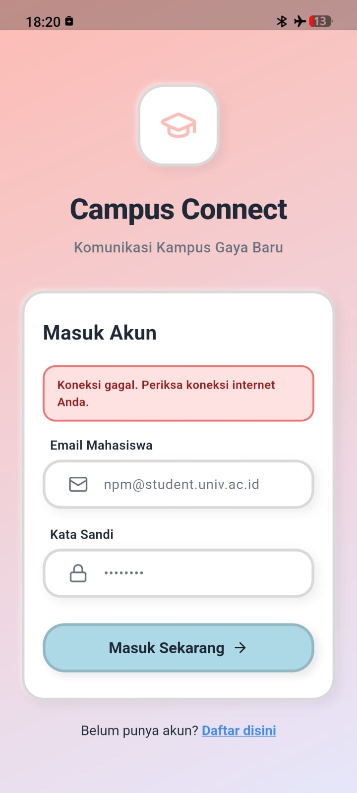
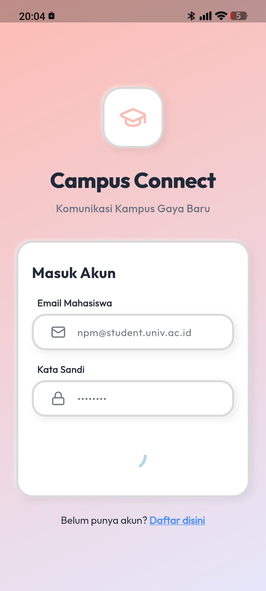

**Integrasi REST API:**
- `POST /api/v1/auth/register` - Mendaftarkan akun baru
- `POST /api/v1/auth/login` - Autentikasi (email/username + password), mengembalikan token
- Token disimpan di FlutterSecureStorage via AuthNotifier
- Dio interceptor menyisipkan header `Authorization: Bearer <token>` pada setiap request
- `GET /api/v1/auth/me` - Memuat data user setelah login
- `POST /api/v1/auth/logout` - Menghapus token dan session

### 2. Beranda & Feed

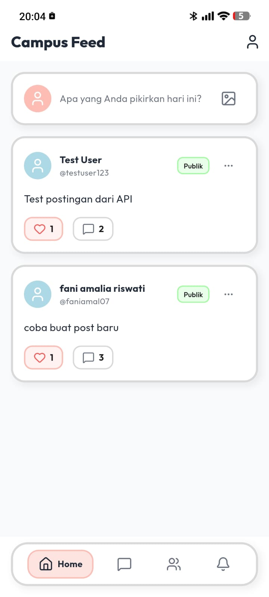
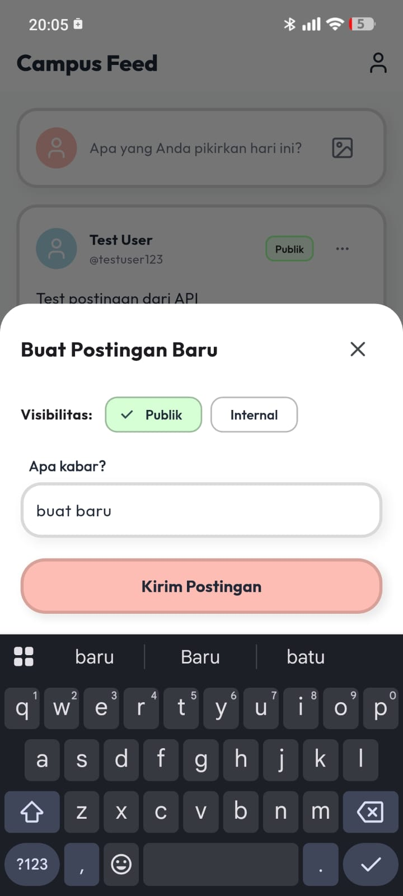

**Integrasi REST API:**
- `GET /api/v1/posts?limit=` - Memuat feed postingan (paginated) via FeedNotifier
- `POST /api/v1/posts` - Membuat postingan baru dengan upload media
- `POST /api/v1/posts/{id}/reactions` - Toggle reaksi (like/love/dll), hapus jika sudah ada
- `POST /api/v1/posts/{id}/comments` - Menambahkan komentar ke postingan
- `DELETE /api/v1/posts/{id}` - Menghapus postingan sendiri

### 3. Chat & Pesan

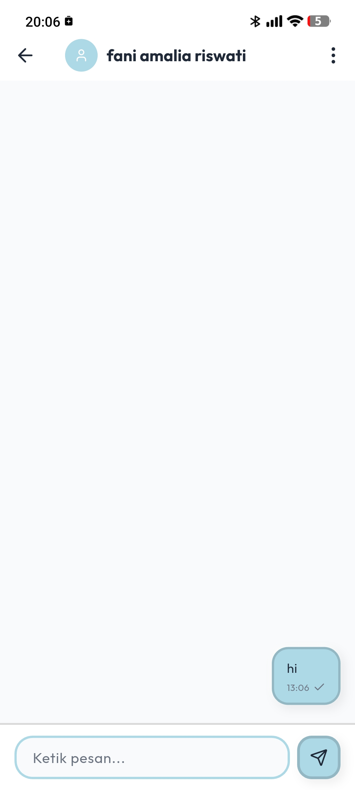
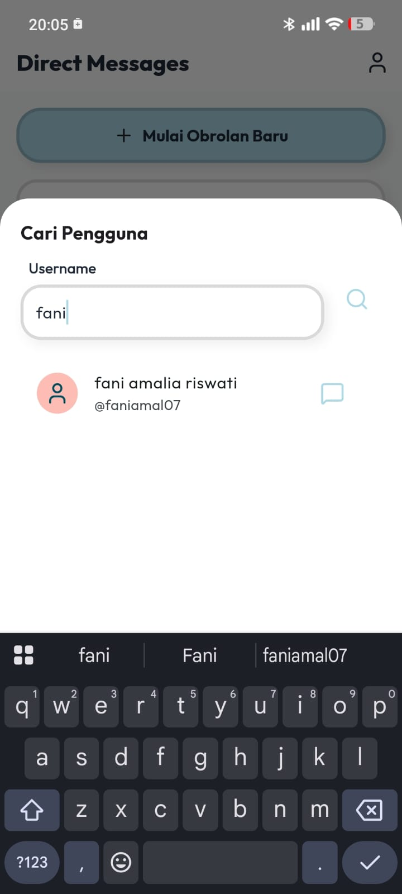
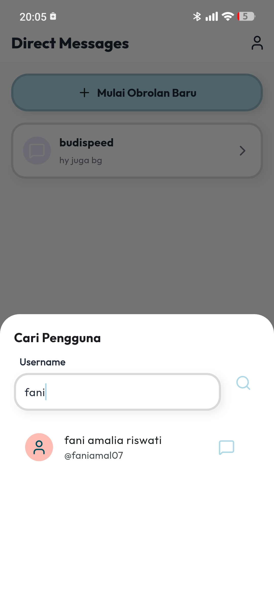
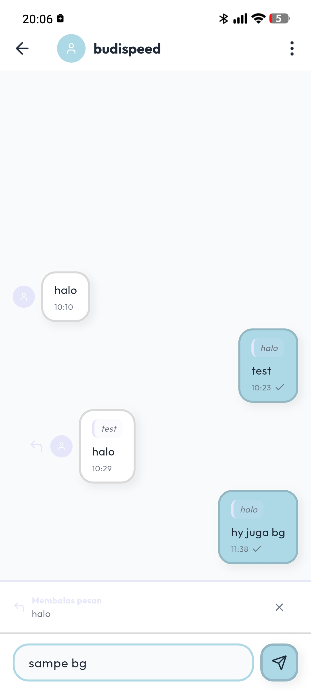
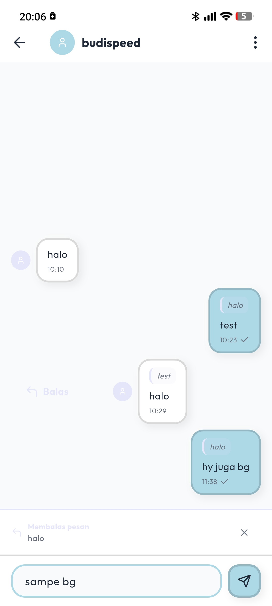
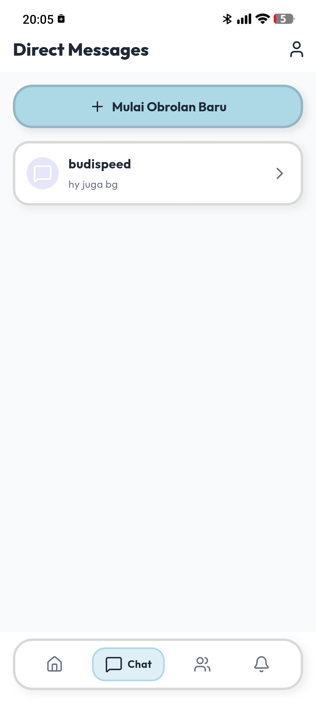

**Integrasi REST API:**
- `GET /api/v1/conversations` - Daftar percakapan user
- `POST /api/v1/conversations` - Membuat chat baru (direct/group)
- `GET /api/v1/conversations/{id}/messages?cursor=` - Riwayat pesan (cursor pagination)
- `POST /api/v1/conversations/{id}/messages` - Kirim pesan (text + file)
- `POST /api/v1/messages/{id}/read` - Tandai pesan terbaca
- `POST /api/v1/conversations/{id}/read-all` - Tandai semua terbaca
- `POST /api/v1/conversations/{id}/invite` - Undang user ke grup
- `POST /api/v1/invitations/{id}/respond` - Terima/tolak undangan grup
- `POST /api/v1/conversations/{id}/leave` - Keluar dari grup
- Real-time via WebSocket (Laravel Reverb): event `MessageSent`, `MessageRead`

### 4. Forum & Diskusi

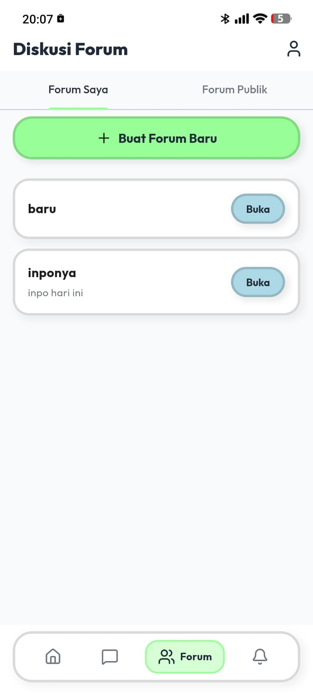


**Integrasi REST API:**
- `GET /api/v1/forums` - Daftar forum publik
- `GET /api/v1/forums/my` - Forum yang diikuti user
- `POST /api/v1/forums` - Buat forum baru
- `POST /api/v1/forums/{id}/join` - Bergabung ke forum
- `POST /api/v1/forums/{id}/leave` - Keluar dari forum
- `POST /api/v1/forums/{id}/topics` - Buat topik diskusi baru
- `GET /api/v1/topics/{id}` - Detail topik beserta komentar
- `POST /api/v1/forums/{id}/invite` - Undang user ke forum private

### 5. Komentar & Balasan

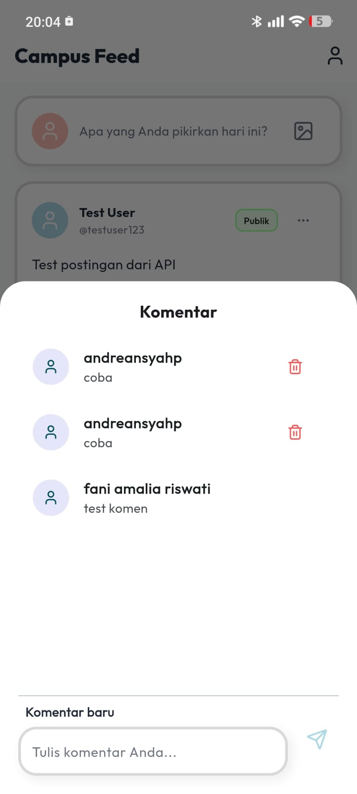

**Integrasi REST API:**
- `POST /api/v1/topics/{id}/comments` - Kirim komentar (mendukung nested reply via `parent_comment_id`)
- `DELETE /api/v1/comments/{id}` - Hapus komentar sendiri
- Upload media pendukung ke komentar

### 6. Notifikasi

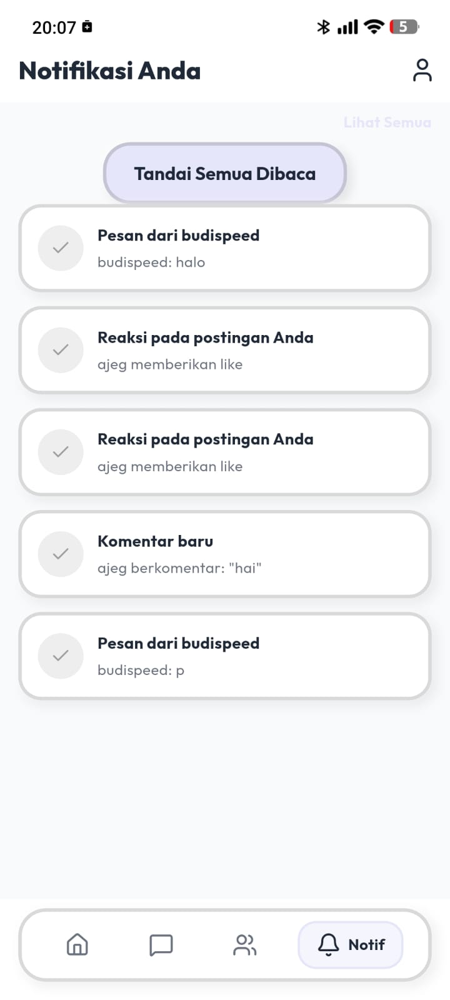
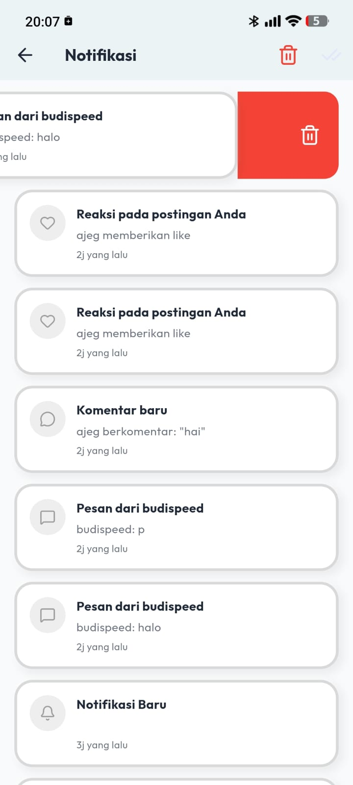

**Integrasi REST API:**
- `GET /api/v1/notifications?limit=` - Daftar notifikasi
- `GET /api/v1/notifications/unread-count` - Jumlah notifikasi belum dibaca
- `PUT /api/v1/notifications/{id}/read` - Tandai notifikasi dibaca
- `PUT /api/v1/notifications/read-all` - Tandai semua dibaca
- `DELETE /api/v1/notifications/{id}` - Hapus notifikasi
- Real-time event: `NotificationCreated` via WebSocket (Laravel Reverb)

### 7. Penghapusan Data

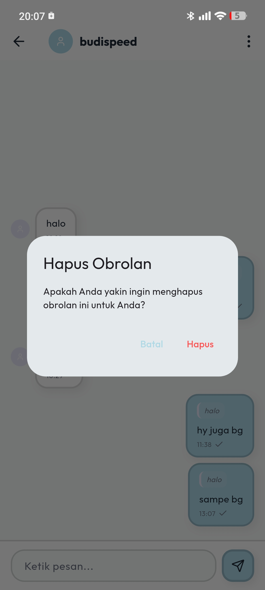
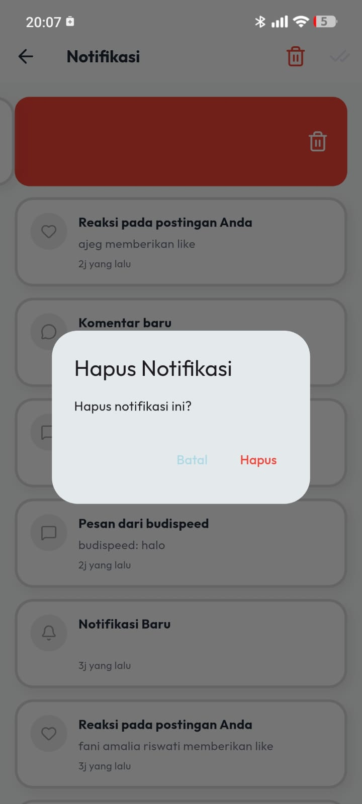

**Integrasi REST API:**
- `DELETE /api/v1/conversations/{id}` - Hapus percakapan dari sisi user
- `DELETE /api/v1/messages/{id}` - Hapus pesan tertentu

### 8. Profil & Pelaporan

**Integrasi REST API:**
- `GET /api/v1/users/{username}` - Lihat profil pengguna lain
- `PUT /api/v1/users/profile` - Update profil sendiri
- `POST /api/v1/users/avatar` - Upload foto profil
- `POST /api/v1/users/{id}/block` - Blokir pengguna
- `POST /api/v1/users/{id}/unblock` - Buka blokir
- `POST /api/v1/reports` - Laporkan konten (polymorphic: post/user)

---

## 🔄 Cara Instalasi & Menjalankan

```bash
# Clone repository
git clone <repository-url>
cd campus_connect_flutter

# Install dependencies
flutter pub get

# Jalankan aplikasi
flutter run
```

---

## 📄 Lisensi

Lisensi proyek ini adalah open source.

---

## 📞 Kontak & Dukungan

- **Issues:** Laporkan bug melalui GitHub Issues
- **Documentation:** Update README dan dokumentasi lain
- **Community:** Bergabung dengan diskusi di repository
- **Feedback:** Berikan masukan melalui fitur feedback aplikasi
